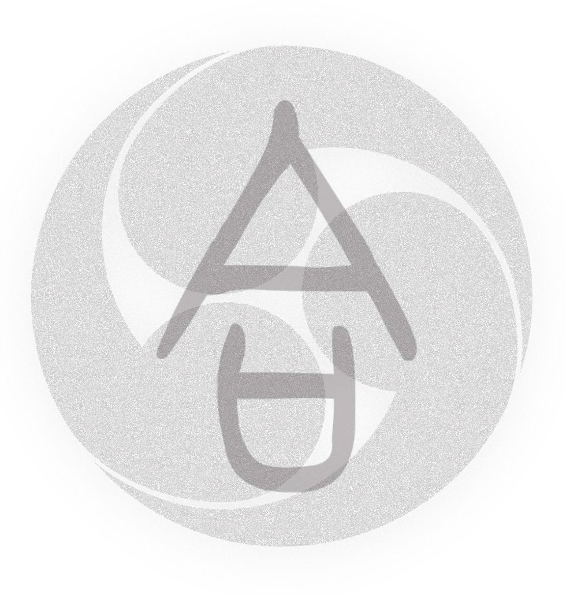

      
    <em>
    </em>

# 
`Awesome quantum computer vision (Q-CV)`

 

   

 The list will be continually updated. Stay tuned!

< **Last updated: Aug/21/2023** >
        

  
Table of Contents

  <ol>
    <li>
      <a href="#Methodologies">Methodologies</a>
      <ul>
        <li><a href="#Year 2023">Year 2023</a></li>
        <li><a href="#Year 2022">Year 2022</a></li>
        <li><a href="#Year 2021">Year 2021</a></li>
        <li><a href="#Year 2020">Year 2020</a></li>
      </ul>
    </li>
    <li><a href="#Contact">Contact</a></li>
  </ol>

## Methodologies

### Year 2023

**Year** | **Publication** | **Title** | **Preprint** | **Project Page** 
:-: | :-:| :- | :-: |  :-: 
**2023** | **ICLR** | [QuAnt: Quantum Annealing with Learnt Couplings](https://openreview.net/pdf?id=isiQ5KIXbjj) | [arXiv](https://arxiv.org/pdf/2210.08114.pdf) | [Link](https://4dqv.mpi-inf.mpg.de/QuAnt/)
**2023** | **CVPR** | [CCuantuMM: Cycle-Consistent Quantum-Hybrid Matching of Multiple Shapes](https://openaccess.thecvf.com/content/CVPR2023/papers/Bhatia_CCuantuMM_Cycle-Consistent_Quantum-Hybrid_Matching_of_Multiple_Shapes_CVPR_2023_paper.pdf) | [arXiv](https://arxiv.org/pdf/2303.16202.pdf) | [Link](https://4dqv.mpi-inf.mpg.de/CCuantuMM/)
**2023** | **CVPR** | [Quantum Multi Model Fitting](https://openaccess.thecvf.com/content/CVPR2023/papers/Farina_Quantum_Multi-Model_Fitting_CVPR_2023_paper.pdf) | [arXiv](https://arxiv.org/pdf/2303.15444.pdf) | [Link](https://github.com/FarinaMatteo/qmmf)
**2023** | **ICML** | [A Hybrid Quantum-Classical Approach based on the Hadamard Transform for the Convolutional Layer](https://proceedings.mlr.press/v202/pan23d/pan23d.pdf) | [arXiv](https://arxiv.org/pdf/2305.17510.pdf) | [Link](https://github.com/phy710/icml2023-ht)

### Year 2022
    
**Year** | **Publication** | **Title** | **Preprint** | **Project Page** 
:-: | :-:| :- | :-: |  :-: 
**2022** | **CVPR** | [Adiabatic Quantum Computing for Multi Object Tracking](https://openaccess.thecvf.com/content/CVPR2022/papers/Zaech_Adiabatic_Quantum_Computing_for_Multi_Object_Tracking_CVPR_2022_paper.pdf) | [arXiv](https://arxiv.org/pdf/2202.08837.pdf)
**2022** | **CVPR** | [A Hybrid Quantum-Classical Algorithm for Robust Fitting](https://openaccess.thecvf.com/content/CVPR2022/papers/Doan_A_Hybrid_Quantum-Classical_Algorithm_for_Robust_Fitting_CVPR_2022_paper.pdf) | [arXiv](https://arxiv.org/pdf/2201.10110.pdf)
**2022** | **ECCV** | [Q-FW: A Hybrid Classical-Quantum Frank-Wolfe for Quadratic Binary Optimization](https://www.ecva.net/papers/eccv_2022/papers_ECCV/papers/136830341.pdf) | [arXiv](https://arxiv.org/pdf/2203.12633.pdf)
**2022** | **ECCV** | [Quantum Motion Segmentation](https://www.ecva.net/papers/eccv_2022/papers_ECCV/papers/136890497.pdf) | [arXiv](https://arxiv.org/pdf/2203.13185.pdf) | [Link](https://4dqv.mpi-inf.mpg.de/QuMoSeg/)

### Year 2021
    
**Year** | **Publication** | **Title** | **Preprint** | **Project Page** 
:-: | :-:| :- | :-: |  :-: 
**2021** | **CVPR** | [Quantum Permutation Synchronization](https://openaccess.thecvf.com/content/CVPR2021/papers/Birdal_Quantum_Permutation_Synchronization_CVPR_2021_paper.pdf) | [arXiv](https://arxiv.org/pdf/2101.07755.pdf) | [Link](https://vcai.mpi-inf.mpg.de/projects/QUANTUMSYNC/)
**2021** | **ICCV** | [Q-Match: Iterative Shape Matching via Quantum Annealing](https://openaccess.thecvf.com/content/ICCV2021/papers/Benkner_Q-Match_Iterative_Shape_Matching_via_Quantum_Annealing_ICCV_2021_paper.pdf) | [arXiv](https://arxiv.org/pdf/2105.02878.pdf) | [Link](https://4dqv.mpi-inf.mpg.de/QMATCH/)

### Year 2020
    
**Year** | **Publication** | **Title** | **Preprint** | **Project Page** 
:-: | :-:| :- | :-: |  :-: 
**2020** | **3DV** | [Adiabatic Quantum Graph Matching with Permutation Matrix Constraints](https://vcai.mpi-inf.mpg.de/projects/QGM/data/SeelbachBenkner_etal.pdf) | [arXiv](https://arxiv.org/pdf/2107.04032.pdf) | [Link](https://vcai.mpi-inf.mpg.de/projects/QGM/)
**2020** | **ECCV** | [Quantum-soft QUBO Suppression for Accurate Object Detection](https://www.ecva.net/papers/eccv_2020/papers_ECCV/papers/123740154.pdf) | [arXiv](https://arxiv.org/pdf/2007.13992.pdf) 

## Contact
    
Feel free to drop an e-mail to junpuzhang.2022@gmail.com.
